# Verification

One of the important aspect of Chaos Testing is the
ability to verify the system's state before/during/after the attack.
The user of the tool should have the ability to verify if the system
under experiment is in a steady state before actually performing the attack.

YChaos' verifcation component, does just that. It provides the user with
various plugins that can be integrated within their YChaos Testplan to
verify the system is in a state that it is expected to be in.

A simple example of this would be the HTTP Request plugin. The user of
YChaos provides a list of HTTP endpoints to be hit with certain status codes
and latency with which the user of YChaos can assert the system is
in a good state before performing the attack.

A sample testplan with HTTP verification plugin integrated is
provided below. The configuration of `http_request` plugin is 
[here][vzmi.ychaos.testplan.verification.HTTPRequestVerification].

```yaml
description: A Demo Testplan
verification:
  - states:
      - STEADY
    type: http_request
    config:
        urls:
            - yourawesomeservice1.com:4443/path
            - yourawesomeservice2.com:4443/path
        params:
            key1: "value1"
            key2: "value2"
        count: 3
        # Number of HTTP calls to be made to these endpoints
        latency: 1000
        # If your services return a valid response with latency>1000ms
        # the verification fails.
attack:
    target_type: machine
    agents:
        - type: no_op
```

When run with CLI, 

```bash
ychaos verify -t testplan.yaml --state steady
```

YChaos makes HTTP calls to these endpoints `count` times and verifies
that the services return a valid response along with verifying
that the response time is less than what is mentioned in `latency` field.

YChaos also provides 2 other plugins out of the box namely
[SDV4VerificationPlugin][vzmi.ychaos.testplan.verification.SDv4Verification] and
[PythonModuleVerificationPlugin][vzmi.ychaos.testplan.verification.PythonModuleVerification]

## YChaos Verification Architecture

Following diagram illustrates the code architecture of YChaos'
verification component


